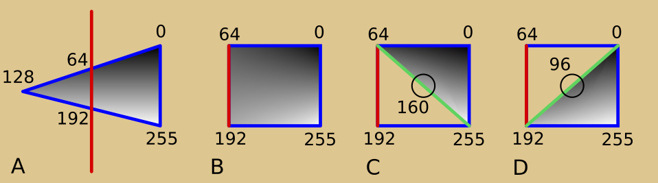

# F3DEX3

Modern microcode for N64 romhacks. Will make you want to finally ditch HLE.
Heavily modified version of F3DEX2, partially rewritten from scratch.

**F3DEX3 is in alpha. It is not guaranteed to be bug-free, and updates may bring
breaking changes.**

## Features

### New visual features

- New geometry mode bit `G_PACKED_NORMALS` enables **simultaneous vertex colors
  and normals/lighting on the same mesh**, by encoding the normals in the unused
  2 bytes of each vertex using a variant of [octahedral encoding](https://knarkowicz.wordpress.com/2014/04/16/octahedron-normal-vector-encoding/).
  The normals are effectively as precise as with the vanilla method of replacing
  vertex RGB with normal XYZ.
- New geometry mode bit `G_AMBOCCLUSION` enables **ambient occlusion** for
  opaque materials. Paint the shadow map into the vertex alpha channel; separate
  factors (set with `SPAmbOcclusion`) control how much this affects the ambient
  light, all directional lights, and all point lights.
- New geometry mode bit `G_LIGHTTOALPHA` moves light intensity (maximum of R, G,
  and B of what would normally be the shade color after lighting) to shade
  alpha. Then, if `G_PACKED_NORMALS` is also enabled, the shade RGB is set to
  the vertex RGB. Together with alpha compare and some special display lists
  from fast64 which draw triangles two or more times with different CC settings,
  this enables **cel shading**. Besides cel shading, `G_LIGHTTOALPHA` can also
  be used for [bump mapping](https://renderu.com/en/spookyiluhablog/post/23631)
  or other unusual CC effects (e.g. texture minus vertex color times lighting).
- New geometry mode bits `G_FRESNEL_COLOR` or `G_FRESNEL_ALPHA` enable
  **Fresnel**. The dot product between a vertex normal and the vector from the
  vertex to the camera is computed; this is then scaled and offset with settable
  factors. The resulting value is then stored to shade color or shade alpha.
  This is useful for:
    - making surfaces like water and glass fade between transparent when viewed
      straight-on and opaque when viewed at a large angle
    - applying a fake "outline" around the border of meshes
    - the N64 bump mapping implementation mentioned above
- New geometry mode bit `G_LIGHTING_SPECULAR` changes lighting computation from
  diffuse to **specular**. If enabled, the vertex normal for lighting is
  replaced with the reflection of the vertex-to-camera vector over the vertex
  normal. Also, a new size value for each light controls how large the light
  reflection appears to be. This technique is lower fidelity in some ways than
  the vanilla `hilite` system, as it is per-vertex rather than per-pixel, but it
  allows the material to be textured normally. Plus, it supports all scene
  lights (including point) with different dynamic colors, whereas the vanilla
  system supports up to two directional lights and more than one dynamic color
  is difficult.
- New geometry mode bits `G_ATTROFFSET_ST_ENABLE` and `G_ATTROFFSET_Z_ENABLE`
  apply settable offsets to vertex ST (`SPAttrOffsetST`) and/or Z
  (`SPAttrOffsetZ`) values. These offsets are applied after their respective
  scales. For Z, this enables a method of drawing coplanar surfaces like decals
  but **without the Z fighting** which can happen with the RDP's native decal
  mode. For ST, this enables **UV scrolling** without CPU intervention.

### Performance improvements

- **56 verts** can fit into DMEM at once, up from 32 verts in F3DEX2, and only
  13% below the 64 verts of reject microcodes. This reduces DRAM traffic and
  RSP time as fewer verts have to be reloaded and re-transformed, and also makes
  display lists shorter.
- New **occlusion plane** system allows the placement of a 3D quadrilateral
  where objects behind this plane in screen space are culled. This can
  dramatically improve RDP performance by reducing overdraw in scenes with walls
  in the middle, such as a city or an indoor scene.
- If a material display list being drawn is the same as the last material, the
  texture loads in the material are skipped (the second time). This effectively
  results in **auto-batched rendering** of repeated objects, as long as each
  only uses one material. This system supports multitexture and all types of
  loads.
- New `SPTriangleStrip` and `SPTriangleFan` commands **pack up to 5 tris** into
  one 64-bit GBI command (up from 2 tris in F3DEX2). In any given object, most
  tris can be drawn with these commands, with only a few at the end drawn with
  `SP2Triangles` or `SP1Triangle`. So, this cuts the triangle portion of display
  lists roughly in half, saving DRAM traffic and ROM space.
- New `SPAlphaCompareCull` command enables culling of triangles whose computed
  shade alpha values are all below or above a settable threshold. This
  **substantially reduces the performance penalty of cel shading**--only tris
  which "straddle" the cel threshold are drawn twice, the others are only drawn
  once.
- A new "hints" system encodes the expected size of the target display list into
  call, branch, and return DL commands. This allows only the needed number of DL
  commands in the next DL to be fetched, rather than always fetching full
  buffers, **saving some DRAM traffic** (maybe around 100 us per frame). The
  bits used for this are ignored by HLE.
- Segment addresses are now resolved relative to other segments (feature by
  Tharo). This enables a strategy for skipping repeated material DLs: call
  a segment to run the material, remap the segment in the material to a
  display list that immediately returns, and so if the material is called again
  it won't run.

### Miscellaneous

- **Point lighting** has been redesigned. The appearance when a light is close
  to an object has been improved. Fixed a bug in F3DEX2/ZEX point lighting where
  a Z component was accidentally doubled in the point lighting calculations. The
  quadratic point light attenuation factor is now an E3M5 floating-point number.
  The performance penalty for using large numbers of point lights has been
  reduced.
- Maximum number of directional / point **lights raised from 7 to 9**. Minimum
  number of directional / point lights lowered from 1 to 0 (F3DEX2 required at
  least one). Also supports loading all lights in one DMA transfer
  (`SPSetLights`), rather than one per light.
- New `SPLightToRDP` family of commands (e.g. `SPLightToPrimColor`) writes a
  selectable RDP command (e.g. `DPSetPrimColor`) with the RGB color of a
  selectable light (any including ambient). The alpha channel and any other
  parameters are encoded in the command. With some limitations, this allows the
  tint colors of cel shading to **match scene lighting** with no code
  intervention. Also useful for other lighting-dependent effects.

### Profiling

F3DEX3 introduces a suite of performance profiling capabilities. These take the
form of performance counters, which report cycle counts for various operations
or the number of items processed of a given type. There are a total of 21
performance counters across multiple microcode versions. See the Profiling
section below.

## Microcode Configuration

There are several selectable configuration settings when building F3DEX3, which
can be enabled in any combination. With a couple minor exceptions, none of these
settings affect the GBI--in fact, you can swap between the microcode versions on
a per-frame basis if you build multiple versions into your romhack.

### No Occlusion Plane (NOC)

If you are not using the occlusion plane feature in your romhack, you can
use this configuration, which removes the computation of the occlusion plane
in the vertex processing pipeline, saving some RSP time.

If you care about performance, please do consider using the occlusion plane!
RDP time savings of 3-4 ms are common in scenes with reasonable occlusion
planes, and even saving a third of the total RDP time can sometimes happen.
Furthermore, when even a small percentage of the total triangles drawn are
occluded, not only is RDP time saved (which is the point), but RSP time is also
saved from not having to process those tris. This can offset the extra RSP time
for computing the occlusion plane for all vertices.

You can also build both the NOC and base microcodes into your ROM and switch
between them on a per-frame basis. If there is no occlusion plane active or the
best occlusion plane candidate would be very small on screen, you can use the
NOC microcode and save RSP time. If there is a significant occlusion plane, you
can use the base microcode and reduce the RDP time. You could also determine
which version to use on the profiling results from the previous frame: if the
RSP is the bottleneck (e.g. the RDP `CLK - CMD` is high), use the NOC version,
and otherwise use the base version.

### Legacy Vertex Pipeline (LVP)

The primary tradeoff for all the new lighting features in F3DEX3 is increased
RSP time for vertex processing. The base version of F3DEX3 takes about
**2-2.5x** more RSP time for vertex processing than F3DEX2 (see Performance
Results section below), assuming no lighting or directional lights only.
However, under most circumstances, this does not affect the game's overall
framerate:
- This only applies to vertex processing, not triangle processing or other
  miscellaneous microcode tasks. So the total RSP cycles spent doing useful work
  during the frame is only modestly increased.
- The increase in time is only RSP cycles; there is no additional memory
  traffic, so the RDP time is not directly affected.
- In scenes which are complex enough to fill the RSP->RDP FIFO in DRAM, the RSP
  usually spends a significant fraction of time waiting for the FIFO to not be
  full (as revealed by the F3DEX3 performance counters, see below). In these
  cases, slower vertex processing simply means less time spent waiting, and
  little to no change in total RSP time.
- When the FIFO does not fill up, usually the RSP takes significantly less time
  during the frame compared to the RDP, so increased RSP time usually does not
  affect the overall framerate.

As a result, you should always start with the base version of F3DEX3 in your
romhack, and if the RSP never becomes the bottleneck, you can stick with that.

However, if you have done extreme optimizations in your game to reduce RDP time
(i.e. if you are Kaze Emanuar), it's possible for the RSP to sometimes become
the bottleneck with F3DEX3's advanced vertex processing. As a result, the Legacy
Vertex Pipeline (LVP) configuration has been introduced.

This configuration replaces F3DEX3's native vertex and lighting code with a
faster version based on the same algorithms as F3DEX2. This removes:
- Point lighting
- F3DEX3 lighting features: packed normals, ambient occlusion, light-to-alpha
  (cel shading), Fresnel, and specular lighting
- ST attribute offsets

However, it retains all other F3DEX3 features:
- 56 verts, 9 directional lights
- Occlusion plane (optional with NOC configuration)
- Z attribute offsets
- All features not related to vertex/lighting: auto-batched rendering, packed 5
  triangles commands, hints system, etc.

The performance of F3DEX3 vertex processing with both LVP and NOC is almost the
same as that of F3DEX2; see the Performance Results section below.

### Profiling

As mentioned above, F3DEX3 includes many performance counters. There are far too
many counters for a single microcode to maintain, so multiple configurations of
the microcode can be built, each containing a different set of performance
counters. These can be swapped while the game is running so the full set of
counters can be effectively accessed over multiple frames.

There are a total of 21 performance counters, including:
- Counts of vertices, triangles, rectangles, matrices, DL commands, etc.
- Times the microcode was processing vertices, processing triangles, stalled
  because the RDP FIFO in DMEM was full, and stalled waiting for DMAs to finish
- A counter enabling a rough measurement of how long the RDP was stalled
  waiting for RDRAM for I/O to the framebuffer / Z buffer

The default configuration of F3DEX3 provides a few of the most basic counters.
The additional profiling configurations, called A, B, and C (for example
`F3DEX3_BrZ_PA`), provide additional counters, but have two default features
removed to make space for the extra profiling. These two features were selected
because their removal does not affect the RDP render time.
- The `SPLightToRDP` commands are removed (they become no-ops)
- Flat shading mode, i.e. `!G_SHADING_SMOOTH`, is removed (all tris are smooth)

### Branch Depth Instruction (`BrZ` / `BrW`)

Use `BrZ` if the microcode is replacing F3DEX2 or an earlier F3D version (i.e.
SM64), or `BrW` if the microcode is replacing F3DZEX (i.e. OoT or MM). This
controls whether `SPBranchLessZ*` uses the vertex's W coordinate or screen Z
coordinate.

### Debug Normals (`dbgN`)

To help debug lighting issues when integrating F3DEX3 into your romhack, this
feature causes the vertex colors of any material with lighting enabled to be set
to the transformed, normalized world space normals. The X, Y, and Z components
map to R, G, and B, with each dimension's conceptual (-1.0 ... 1.0) range mapped
to (0 ... 255). This is not compatible with LVP as world space normals do not
exist in that pipeline. This also breaks vertex alpha and texgen / lookat.

Some ways to use this for debugging are:
- If the normals have obvious problems (e.g. flickering, or not changing
  smoothly as the object rotates / animates), there is likely a problem with the
  model space normals or the M matrix. Conversely, if there is a problem with
  the standard lighting results (e.g. flickering) but the normals don't have
  this problem, the problem is likely in the lighting data.
- Check that the colors don't change based on the camera position, but DO change
  as the object rotates, so that the same side of an object in world space is
  always the same color.
- Make a simple object like an octahedron or sphere, view it in game, and check
  that the normals are correct. A normal pointing along +X would be
  (1.0, 0.0, 0.0), meaning (255, 128, 128) or pink. A normal pointing along -X
  would be (-1.0, 0.0, 0.0), meaning (0, 128, 128) or dark cyan. Bright, fully
  saturated colors like green (0, 255, 0), yellow (255, 255, 0), or black should
  never appear as these would correspond to impossibly long normals.
- Make the same object (octahedron is easiest in this case) with vertex colors
  which match what the normals should be, and compare them.

## Performance Results

Vertex pipeline cycles per **vertex pair** in steady state (lower is better).
Hand-counted timings taking into account all pipeline stalls and all dual-issue
conditions except for instruction alignment.

| Microcode      | No Lighting | First Dir Lt | Total for 1 Dir Lt | Extra Dir Lts |
|----------------|-------------|--------------|--------------------|---------------|
| F3DEX3         | 98          | 103          | 201                | 29            |
| F3DEX3_NOC     | 79          | 103          | 182                | 29            |
| F3DEX3_LVP     | 81          | 15           | 96                 | 7             |
| F3DEX3_LVP_NOC | 62          | 15           | 77                 | 7             |
| F3DEX2         | 54          | 19           | 73                 | 3 then 12     |

Vertex processing time as reported by the performance counter in the `PA`
configuration.
- Scene 1: Kakariko, adult day, from DMT entrance
- Scene 2: Custom empty scene with Suzanne monkey head with 1 dir light
- Scene 3: Same but Suzanne has vertex colors instead of lighting (Link is still
  on screen and has lighting)

| Microcode      | Scene 1 | Scene 2 | Scene 3 |
|----------------|---------|---------|---------|
| F3DEX3         | 7.64ms  | 3.13ms  | 2.37ms  |
| F3DEX3_NOC     | 7.07ms  | 2.89ms  | 2.14ms  |
| F3DEX3_LVP     | 4.57ms  | 1.77ms  | 1.67ms  |
| F3DEX3_LVP_NOC | 3.96ms  | 1.52ms  | 1.41ms  |
| F3DEX2         | No*     | No*     | No*     |
| Vertex count   | 3664    | 1608    | 1608    |

*F3DEX2 does not contain performance counters, so the portion of the RSP time
taken for vertex processing cannot be measured.

## Porting Your Romhack Codebase to F3DEX3

For an OoT codebase, only a few minor changes are required to use F3DEX3.
However, more changes are recommended to increase performance and enable new
features.

How to modify the microcode in your HackerOoT based romhack (steps may be
similar for other games):
- Replace `include/ultra64/gbi.h` in your romhack with `gbi.h` from this repo.
- Make the "Required Changes" listed below.
- Build this repo: install the latest version of `armips`, then `make
  F3DEX3_BrZ` or `make F3DEX3_BrW`.
- Copy the microcode binaries (`build/F3DEX3_X/F3DEX3_X.code` and
  `build/F3DEX3_X/F3DEX3_X.data`) to somewhere in your romhack repo, e.g. `data`.
- In `data/rsp.rodata.s`, change the line between `fifoTextStart` and
  `fifoTextEnd` to `.incbin "data/F3DEX3_X.code"` (or wherever you put the
  binary), and similarly change the line between `fifoDataStart` and
  `fifoDataEnd` to `.incbin "data/F3DEX3_X.data"`. After both the `fifoTextEnd`
  and `fifoDataEnd` labels, add a line `.balign 16`.
- If you are planning to ever update the microcode binaries in the future,
  add the following to the Makefile of your romhack, after the section starting
  with `build/data/%.o` (i.e. two lines after that, with a blank line before
  and after): `build/data/rsp.rodata.o: data/F3DEX3_X.code data/F3DEX3_X.data`.
  It is not a mistake that this new line you are adding won't have a second
  indented line after it; it is like the `message_data_static` lines below that.
  This will tell `make` to rebuild `rsp.rodata.o`, which includes the microcode
  binaries, whenever they are changed.
- Clean and build your romhack (`make clean`, `make`).
- Test your romhack and confirm that everything works as intended.
- Make as many of the "Recommended changes" listed below as possible.
- If you start using new features in F3DEX3, make the "Changes required for new
  features" listed below.

### Required Changes

Both OoT and SM64:

- Remove uses of internal GBI features which have been removed in F3DEX3 (see "C
  GBI Compatibility" section below for full list). In OoT, the only changes
  needed are:
    - In `src/code/ucode_disas.c`, remove the switch statement cases for
      `G_LINE3D`, `G_MW_CLIP`, `G_MV_MATRIX`, `G_MVO_LOOKATX`, `G_MVO_LOOKATY`,
      and `G_MW_PERSPNORM`.
    - In `src/libultra/gu/lookathil.c`, remove the lines which set the `col`,
      `colc`, and `pad` fields.
- Change your game engine lighting code to set the `type` (formerly `pad1`)
  field to 0 in the initialization of any directional light (`Light_t` and
  derived structs like `Light` or `Lightsn`). F3DEX3 ignores the state of the
  `G_LIGHTING_POSITIONAL` geometry mode bit in all display lists, meaning both
  directional and point lights are supported for all display lists (including
  vanilla). The light is identified as directional if `type` == 0 or point if
  `kc` > 0 (`kc` and `type` are the same byte). This change is required because
  otherwise garbage nonzero values may be put in the padding byte, leading
  directional lights to be misinterpreted as point lights.
    - The change needed in OoT is: in `src/code/z_lights.c`, in
      `Lights_BindPoint`, `Lights_BindDirectional`, and `Lights_NewAndDraw`, set
      `l.type` to 0 right before setting `l.col`.

SM64 only:

- If you are using the vanilla lighting system where light directions are always
  fixed, the vanilla permanent light direction of `{0x28, 0x28, 0x28}` must be
  changed to `{0x49, 0x49, 0x49}`, or everything will be too dark. The former
  vector is not properly normalized, but F3D through F3DEX2 normalize light
  directions in the microcode, so it doesn't matter with those microcodes. In
  contrast, F3DEX3 normalizes vertex normals (after transforming them), but
  assumes light directions have already been normalized.
- Matrix stack fix (world space lighting / view matrix in VP instead of in M) is
  basically required. If you *really* want camera space lighting, use matrix
  stack fix, transform the fixed camera space light direction by V inverse each
  frame, and send that to the RSP. This will be faster than the alternative (not
  using matrix stack fix and enabling `G_NORMALS_MODE_AUTO` to correct the
  matrix).

### Recommended Changes (Non-Lighting)

- Clean up any code using the deprecated, hacky `SPLookAtX` and `SPLookAtY` to
  use `SPLookAt` instead (this is only a few lines change). Also remove any
  code which writes `SPClipRatio` or `SPForceMatrix`--these are now no-ops, so
  you might as well not write them.
- Avoid using `G_MTX_MUL` in `SPMatrix`. That is, make sure your game engine
  computes a matrix stack on the CPU and sends the final matrix for each object
  / limb to the RSP, rather than multiplying matrices on the RSP. OoT already
  usually does the former for precision / accuracy reasons and only uses
  `G_MTX_MUL` in a couple places (e.g. view * perspective matrix); it is okay to
  leave those. This change is recommended because the `G_MTX_MUL` mode of
  `SPMatrix` has been moved to Overlay 4 in F3DEX3 (see below), making it
  substantially slower than it was in F3DEX2. It still functions the same though
  so you can use it if it's really needed.
- Re-export as many display lists (scenes, objects, skeletons, etc.) as possible
  with fast64 set to F3DEX3 mode, to take advantage of the substantially larger
  vertex buffer, triangle packing commands, "hints" system, etc.
- `#define REQUIRE_SEMICOLONS_AFTER_GBI_COMMANDS` (at the top of, or before
  including, the GBI) for a more modern, OoT-style codebase where uses of GBI
  commands require semicolons after them. SM64 omits the semicolons sometimes,
  e.g. `gSPDisplayList(gfx++, foo) gSPEndDisplayList(gfx++);`. If you are using
  `-Wpedantic`, using this define is required.
- Once everything in your romhack is ported to F3DEX3 and everything is stable,
  `#define NO_SYNCS_IN_TEXTURE_LOADS` (at the top of, or before including, the
  GBI) and fix any crashes or graphical issues that arise. Display lists
  exported from fast64 already do not contain these syncs, but vanilla display
  lists or custom ones using the texture loading multi-command macros do.
  Disabling the syncs saves a few percent of RDP cycles for each material setup;
  what percentage this is of the total RDP time depends on how many triangles
  are typically drawn between each material change. For more information, see
  the GBI documentation near this define.

### Recommended Changes (Lighting)

- Change your game engine lighting code to load all lights in one DMA transfer
  with `SPSetLights`, instead of one-at-a-time with repeated `SPLight` commands.
  Note that if you are using a pointer (dynamically allocated) rather than a
  direct variable (statically allocated), you need to dereference it; see the
  docstring for this macro in the GBI.
- If you still need to use `SPLight` somewhere after this, use `SPLight` only
  for directional / point lights and use `SPAmbient` for ambient lights.
  Directional / point lights are 16 bytes and ambient are 8, and the first 8
  bytes are the same for both types, so normally it's okay to use `SPLight`
  instead of `SPAmbient` to write ambient lights too. However, the memory space
  reserved for lights in the microcode is 16*9+8 bytes, so if you have 9
  directional / point lights and then use `SPLight` to write the ambient light,
  it will overflow the buffer by 8 bytes and corrupt memory.
- Once you have made the above change for `SPAmbient`, increase the maximum
  number of lights in your engine from 7 to 9.
- Consider setting lights once before rendering a scene and all actors, rather
  than setting lights before rendering each actor. OoT does the latter to
  emulate point lights in a scene with a directional light recomputed per actor.
  You can now just send those to the RSP as real point lights, regardless of
  whether the display lists are vanilla or new.
- If you are porting a game which already had point lighting (e.g. Majora's
  Mask), note that the point light kc, kl, and kq factors have been changed, so
  you will need to redesign how game engine light parameters (e.g. "light
  radius") map to these parameters.

### Changes Required for New Features

Each of these changes is required if you want to use the respective new feature,
but is not necessary if you are not using it.

- For Fresnel and specular lighting: Whenever your code sends camera properties
  to the RSP (VP matrix, viewport, etc.), also send the camera world position to
  the RSP with `SPCameraWorld`. For OoT, this is not trivial because the game
  rendering creates and sets the view matrix in the main DL, then renders the
  game contents, then updates the camera, and finally retroactively modifies the
  view matrix at the beginning of the main DL. See the code in `cpu/camera.c`.
- For specular lighting: Set the `size` field of any `Light_t` and `PosLight_t`
  to an appropriate value based on the game engine parameters for that light.
- For the occlusion plane: Bring the code from `cpu/occlusionplane.c` into your
  game and follow the included instructions.
- For the performance counters: See `cpu/counters.c`.

## Backwards Compatibility with F3DEX2

### C GBI Compatibility

F3DEX3 is backwards compatible with F3DEX2 at the C GBI level for all features
and commands except:

- The `G_SPECIAL_*` command IDs have been removed. `G_SPECIAL_2` and
  `G_SPECIAL_3` were no-ops in F3DEX2, and `G_SPECIAL_1` was a trigger to
  recalculate the MVP matrix. There is no MVP matrix in F3DEX3 so this is
  useless.
- `G_LINE3D` (and `Gfx.line`) has been removed. This command did not actually
  work in F3DEX2 (it behaved as a no-op).
- `G_MW_CLIP` has been removed, and `SPClipRatio` has been converted into a
  no-op. Clipping is handled differently in F3DEX3 and the clip ratio cannot be
  changed from 2.
- `G_MV_MATRIX`, `G_MW_MATRIX`, and `G_MW_FORCEMTX` have been removed, and
  `SPForceMatrix` has been converted into a no-op. This is because there is no
  MVP matrix in F3DEX3.
- `G_MV_POINT` has been removed. This was not used in any command; it would have
  likely been used for debugging to copy vertices from DMEM to examine them.
  This does not affect `SPModifyVertex`, which is still supported.
- `G_MW_PERSPNORM` has been removed; `SPPerspNormalize` is still supported but
  is encoded differently, no longer using this define.
- `G_MVO_LOOKATX` and `G_MVO_LOOKATY` have been removed, and `SPLookAtX` and
  `SPLookAtY` are deprecated. `SPLookAtX` has been changed to set both
  directions and `SPLookAtY` has been converted to a no-op. To set the lookat
  directions, use `SPLookAt`. The lookat directions are now in one 8-byte DMA
  word, so they must always be set at the same time as each other. Most of the
  non-functional fields (e.g. color) of `LookAt` and its sub-types have been
  removed, so code which accesses these fields needs to change. Code which only
  accesses lookat directions should be compatible with no changes.
- As discussed above, the `pad1` field of `Light_t` is renamed to `type` and
  must be set to zero.
- If you do not raise the maximum number of lights from 7 to 9, the lighting GBI
  commands are backwards compatible. However, if you do raise the number of
  lights, you must use `SPAmbient` to write the ambient light, as discussed
  above. Note that you can now load all your lights with one command,
  `SPSetLights`, so it is not usually necessary to use `SPLight` and `SPAmbient`
  at all.

### Binary Display List Compatibility

F3DEX3 is generally binary backwards compatible with OoT-style display lists for
objects, scenes, etc. **It is not compatible at the binary level with SM64-style
display lists which encode object colors as light colors**, as all the command
encodings related to lighting have changed. Of course, if you recompile these
display lists with the new `gbi.h`, it can run them.

The deprecated commands mentioned above in the C GBI section have had their
encodings changed (the original encodings will do bad things / crash). In
addition, all lighting-related commands--e.g. `gdSPDefLights*`, `SPNumLights`,
`SPLight`, `SPLightColor`, `SPLookAt`--have had their encodings changed, making
them binary incompatible. The lighting data structures, e.g. `Light_t`,
`PosLight_t`, `LookAt_t`, `Lightsn`, `Lights*`, `PosLights*`, etc., have also
changed--generally only slightly, so most code is compatible with no changes.

`SPSegment` has been given a different command id (`G_RELSEGMENT` vs.
`G_MOVEWORD`) to facilitate relative segmented address translation. The
original binary encoding is still valid, but does not support relative
translation like the new encoding. However, recompiling with the C GBI will
always use the new encoding.

## What are the tradeoffs for all these new features?

### Vertex Processing RSP Time

See the Microcode Configuration and Performance Results sections above.

### Overlay 4

(Note that in the LVP configuration, Overlay 4 is absent; there is no M inverse
transpose matrix discussed below, and the other commands mentioned below are
directly in the microcode without an overlay, due to there being enough IMEM
space.)

F3DEX2 contains Overlay 2, which does lighting, and Overlay 3, which does
clipping (run on any large triangle which extends a large distance offscreen).
These overlays are more RSP assembly code which are loaded into the same space
in IMEM. If the wrong overlay is loaded when the other is needed, the proper
one is loaded and then code jumps to it. Display lists which do not use lighting
can stay on Overlay 3 at all times. Display lists for things that are typically
relatively small on screen, such as characters, can stay on Overlay 2 at all
times, because even when a triangle overlaps the edge of the screen, it
typically moves fully off the screen and is discarded before it reaches the
clipping bounds (2x the screen size).

In F3DEX2, the only case where the overlays are swapped frequently is for
scenes with lighting, because they have large triangles which often extend far
offscreen (Overlay 3) but also need lighting (Overlay 2). Worst case, the RSP
will load Overlay 2 once for every `SPVertex` command and then load Overlay 3
for every set of `SP*Triangle*` commands.

(If you're curious, Overlays 0 and 1 are not related to 2 and 3, and have to do
with starting and stopping RSP tasks. During normal display list execution,
Overlay 1 is always loaded.)

F3DEX3 introduces Overlay 4, which can occupy the same IMEM as Overlay 2 and 3.
This overlay contains handlers for:
- Computing the inverse transpose of the model matrix M (abbreviated as mIT),
  discussed below
- The codepath for `SPMatrix` with `G_MTX_MUL` set (base version only; this is
  moved out of the overlay to normal microcode in the NOC configuration due to
  having extra IMEM space available)
- `SPBranchLessZ*`
- `SPDma_io`

Whenever any of these features is needed, the RSP has to swap to Overlay 4. The
next time lighting or clipping is needed, the RSP has to then swap back to
Overlay 2 or 3. The round-trip of these two overlay loads takes about 5
microseconds of DRAM time including overheads. Fortunately, all the above
features other than the mIT matrix are rarely or never used.

The mIT matrix is needed in F3DEX3 because normals are covectors--they stretch
in the opposite direction of an object's scaling. So while you multiply a vertex
by M to transform it from model space to world space, you have to multiply a
normal by M inverse transpose to go to world space. F3DEX2 solves this problem
by instead transforming light directions into model space with M transpose, and
computing the lighting in model space. However, this requires extra DMEM to
store the transformed lights, and adds an additional performance penalty for
point lighting which is absent in F3DEX3. Plus, having world space normals in
F3DEX3 enables Fresnel and specular lighting.

If an object's transformation matrix stack only includes translations,
rotations, and uniform scale (i.e. same scale in X, Y, and Z), then M inverse
transpose is just a rescaled version of M, and the normals can be transformed
with M directly. It is only when the matrix includes nonuniform scales or shear
that M inverse transpose differs from M. The difference gets larger as the scale
or shear gets more extreme.

F3DEX3 provides three options for handling this (see `SPNormalsMode`):
- `G_NORMALS_MODE_FAST`: Use M to transform normals. No performance penalty.
  Lighting will be somewhat distorted for objects with nonuniform scale or
  shear.
- `G_NORMALS_MODE_AUTO`: The RSP will automatically compute M inverse transpose
  whenever M changes. Costs about 3.5 microseconds of DRAM time per matrix, i.e.
  per object or skeleton limb which has lighting enabled. Lighting is correct
  for nonuniform scale or shear.
- `G_NORMALS_MODE_MANUAL`: You compute M inverse transpose on the CPU and
  manually upload it to the RSP every time M changes.

It is recommended to use `G_NORMALS_MODE_FAST` (the default) for most things,
and use `G_NORMALS_MODE_AUTO` only for objects while they currently have a
nonuniform scale (e.g. Mario only while he is squashed).

### Optimizing for RSP code size

A number of optimizations in F3DEX2 which saved a few cycles but took several
more instructions have been removed. Outside of vertex processing, these have a
very small impact on overall RSP time and no impact on RDP time.

### Far clipping removal

Far clipping is completely removed in F3DEX3. Far clipping is not intentionally
used for performance or aesthetic reasons in levels in vanilla SM64 or OoT,
though it can be seen in certain extreme cases. However, it is used on the SM64
title screen for the zoom-in on Mario's face, so this will look slightly
different.

The removal of far clipping saved a bunch of DMEM space, and enabled other
changes to the clipping implementation which saved even more DMEM space.

NoN (No Nearclipping) is also mandatory in F3DEX3, though this was already the
microcode option used in OoT. Note that tris are still clipped at the camera
plane; nearclipping means they are clipped at the nearplane, which is a short
distance in front of the camera plane.

### Removal of scaled vertex normals

A few clever romhackers figured out that you could shrink the normals on verts
in your mesh (so their length is less than "1") to make the lighting on those
verts dimmer and create a version of ambient occlusion. In the base vertex
pipeline, F3DEX3 normalizes vertex normals after transforming them, which is
required for most features of the lighting system including packed normals, so
this no longer works. However, F3DEX3 has support for ambient occlusion via
vertex alpha, which accomplishes the same goal with some extra benefits:
- Much easier to create: just paint the vertex alpha in Blender / fast64. The
  scaled normals approach was not supported in fast64 and had to be done with
  scripts or by hand.
- The amount of ambient occlusion in F3DEX3 can be set at runtime based on
  variable scene lighting, whereas the scaled normals approach is baked into the
  mesh.
- F3DEX3 can have the vertex alpha affect ambient, directional, and point lights
  by different amounts, which is not possible with scaled normals. In fact,
  scaled normals never affect the ambient light, contrary to the concept of
  ambient occlusion.

Furthermore, for partial HLE compatibility, the same mesh can have the ambient
occlusion information encoded in both scaled normals and vertex alpha at the
same time. HLE will ignore the vertex alpha AO but use the scaled normals;
F3DEX3 will fix the normals' scale but then apply the AO.

The only case where scaled normals work but F3DEX3 AO doesn't work is for meshes
with vertex alpha actually used for transparency (therefore also no fog).

Note that in LVP mode, scaled normals are supported and work the same way as in
F3DEX2, while ambient occlusion is not supported.

### RDP temporary buffers shrinking

In FIFO versions of F3DEX2, there are two DMEM buffers to hold RDP commands
generated by the microcode, which are swapped and copied to the FIFO in DRAM.
These each had the capacity of two-and-a-fraction full-size triangle commands
(i.e. triangles with shade, texture, and Z-buffer). For short commands (e.g.
texture loads, color combiner, etc.) there is a slight performance gain from
having longer buffers in DMEM which are swapped to DRAM less frequently. And, if
a substantial portion of triangles were rendered without shade or texture such
that three tris could fit per buffer, being able to fit the three tris would
also slightly improve performance. However, in practice, the vast majority of
the FIFO is occupied by full-size tris, so the buffers are effectively only two
tris in size because a third tri can't fit. So, their size has been reduced to
two tris, saving a substantial amount of DMEM.

### Segment 0

Segment 0 is now reserved: ensure segment 0 is never set to anything but
0x00000000. In F3DEX2 and prior this was only a good idea (and SM64 and OoT
always follow this); in F3DEX3 segmented addresses are now resolved relative to
other segments. That is, `gsSPSegment(0x08, 0x07001000)` sets segment 8 to the
base address of segment 7 with an additional offset of 0x1000. So for correct
behavior when supplying a direct-mapped or physical address such as 0x80101000,
segment 0 must always be 0x00000000 so that this address resolves to e.g.
0x101000 as expected in this example.

### Obscure semantic differences from F3DEX2 that should never matter in practice

- `SPLoadUcode*` corrupts the current M inverse transpose matrix state. If using
  `G_NORMALS_MODE_FAST`, this doesn't matter. If using `G_NORMALS_MODE_AUTO`,
  you must send the M matrix to the RSP again after returning to F3DEX3 from the
  other microcode (which would normally be done anyway when starting to draw the
  next object). If using `G_NORMALS_MODE_MANUAL`, you must send the updated
  M inverse transpose matrix to the RSP after returning to F3DEX3 from the other
  microcode (which would normally be done anyway when starting to draw the next
  object).
- Changing fog settings--i.e. enabling or disabling `G_FOG` in the geometry mode
  or executing `SPFogFactor` or `SPFogPosition`--between loading verts and
  drawing tris with those verts will lead to incorrect fog values for those
  tris. In F3DEX2, the fog settings at vertex load time would always be used,
  even if they were changed before drawing tris.

## What happened to the clipping minimal scanlines algorithm?

Earlier F3DEX3 versions included a modified algorithm for triangulating the
polygon which was formed as the result of clipping. This algorithm broke up the
polygon into triangles in such a way that the fewest scanlines were accessed
multiple times, leading to maximum performance on the RDP. For example, if the
polygon was a diamond shape, this algorithm would always cut it horizontally--
leading to few or no scanlines being touched by both the top and bottom tris--as
opposed to vertically, leading to all scanlines being touched by the left and
right tris.

In testing, this was able to save a few hundred microseconds at best in scenes
with many large clipped tris. However, this feature has been removed, because it
was found to cause undesirable visual artifacts. Other changes to clipping were
experimented with in the past, and ultimately not included. These are not due to
a bug or design issue with the microcode, but a fundamental limitation of the
RDP: vertex colors are interpolated in screen space without perspective
correction. In other words, the shade colors of any triangle not flat to the
camera are slightly wrong--the same world space portion of the triangle will
have a slightly different color depending on how the camera is rotated around
it. The issues with clipping are a result of this.

To show why this is an unavoidable issue on the N64, here is an example:

A: The triangle has vertex colors 0, 128, 255 (same for all three color
components) as shown. It is clipped off the left side of the screen halfway
through its world-space coordinates, so the generated vertices have colors 64
and 192 respectively.

B: Due to perspective and the clipped vertex being near the camera plane, the
clipped polygon is distorted to this shape.

C: If this polygon is triangulated this way, the point in the middle of the
polygon has color 160 (halfway between 64 and 255).

D: If this polygon is instead triangulated this way, the point in the middle of
the polygon has color 96 (halfway between 192 and 0).

Note that BOTH of these are wrong: the correct value for that pixel is 128,
because all points on the horizontal midline of the original triangle are color
128. The N64 can't draw the correct triangle here--its colors would have to
change nonlinearly along an edge.

The problem with the clipping minimal scanlines algorithm is that it would
switch between cases C and D here based on which diagonal had a larger Y
component. In other words, if the camera moved slightly, the choice of
triangulation might change, causing the middle of the polygon to visibly change
color. This was visible on large scene triangles with lighting: as you walked
around, the colors would have slight but abrupt changes, which look wrong/bad.

The best we can do, which is what all previous F3D family microcodes did and
F3DEX3 does now, is to triangulate in a consistent way, based on the winding
of the input triangles. The results are still wrong, but they're wrong the same
way every frame, so there are no abrupt changes visible.

## Credits

F3DEX3 modifications from F3DEX2 are by Sauraen and are dedicated to the public
domain. `cpu/` C code is entirely by Sauraen and also dedicated to the public
domain.

If you use F3DEX3 in a romhack, please credit "F3DEX3 Microcode - Sauraen" in
your project's in-game Staff Roll or wherever other contributors to your project
are credited.

Other contributors:
- Wiseguy: large chunk of F3DEX2 disassembly documentation and first version of
  build system
- Tharo: relative segment resolution feature, other feature discussions
- Kaze Emanuar: several feature suggestions, testing
- thecozies: Fresnel feature suggestion
- neoshaman: feature discussions
