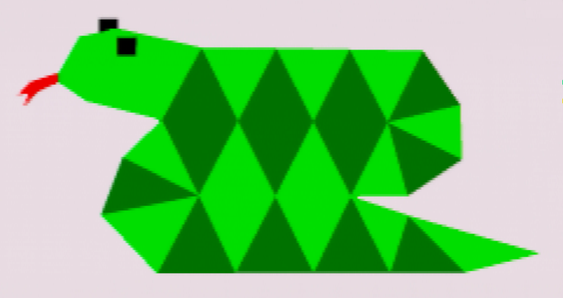
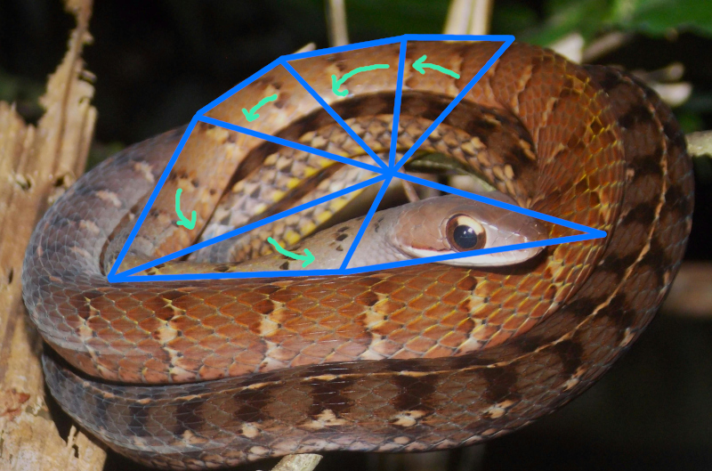
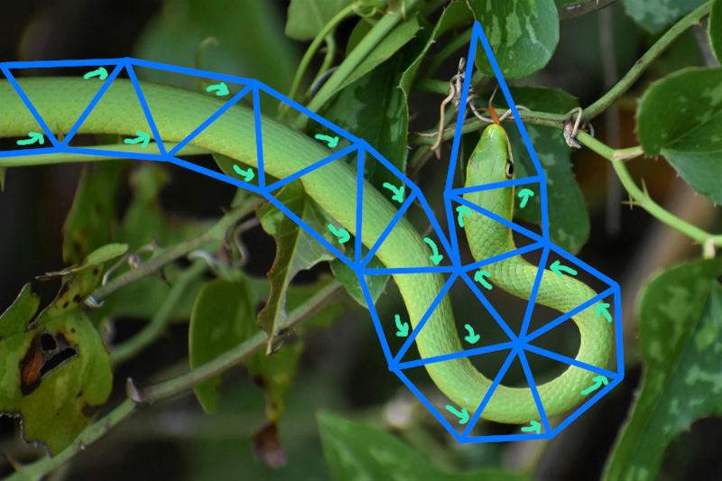

@page snake Triangle Snake

*A triangle snake, drawn with a single F3DEX3 `gsSPTriSnake` command (and 
multiple `gsSPContinueSnake`s). Flat shading is used to emphasize that each
consecutive triangle in the snake has its Vertex 1 be a new index, not the same
as one of the indices of the previous triangle. Drawing this with a single snake
uses 3.7x less memory bandwidth for triangle display list commands compared to
drawing the same mesh with `gsSP2Triangles` commands like in F3DEX2.*

**Triangle Snake** is F3DEX3's new accelerated triangles command. It is capable
of drawing any shape which is expressible as a single, non-branching chain of
connected triangles. At each triangle, the command encodes whether the snake
turns left or right--in other words, whether this triangle is attached to one or
the other of the yet-unconnected edges of the previous triangle. A traditional
triangle strip is a special case of a triangle snake with alternating directions 
(left-right-left-right-etc.), and similarly a traditional triangle fan is a
triangle snake with the same direction repeatedly (left-left-left-etc.).

*A snake can slither by moving in an alternating left and right pattern. This
represents a triangle strip. Original photo by Bui Van Dong, free-use licensed*

*If the snake repeatedly turns in the same direction, it coils up. This
corresponds to a triangle fan. Original photo by Gabriel Rondina, free-use
licensed*

*The snake need not be constrained to either shape; it can turn left or right in
any combination. This can be thought of as concatenating triangle strips and
fans. Original photo by Al d'Vilas, free-use licensed*

A snake can be arbitrarily long. It starts with a `SPTriSnake` command, which
may be followed by one or more `SPContinueSnake` macros which encode continued
indices. The latter are not commands (there's no command byte)--they are just
more index data sequentially in the display list. In other words, the display
list input buffer is the storage for the indices data. The microcode correctly
handles the case when the snake runs off the end of the input buffer and the
input buffer needs to be refilled. The refilled data starts from the start of
the input buffer, as if it were regular commands; this matters for the hints
system.

## Memory Bandwidth

The goal of any accelerated triangles system in a microcode is to reduce the
memory bandwidth used for loading triangle indices. The actual tris drawn are
the same regardless of how their indices are encoded in the display list, so we
do not consider the performance of actually drawing the tris, only loading their
indices.

An `SPTriSnake` command by itself contains 7 vertices and draws 5 triangles
(because the first triangle needs two extra vertices to start itself). An `SPContinueSnake` macro contains 8 vertices and draws 8 tris, in each case
continuing the existing snake. The F3D family microcodes before F3DEX3 only
provided `SP1Triangle` and `SP2Triangle` commands, so any snake of 3 or more
tris is more efficient than F3DEX2 and older microcodes. The efficiency gain
is up to 4x (2 tris -> 8 tris per 8-byte macro), though in typical meshes the
gain is expected to be 2-3x.

## Vertex Cache Locality

The key advantage of a triangle snake over a traditional triangle strip is that
it better exploits the vertex cache. 