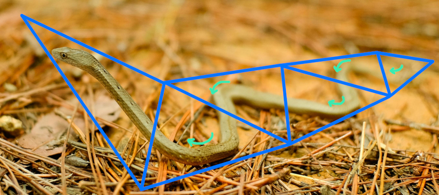

@page snake Triangle Snake

*A triangle snake, drawn with a single F3DEX3 `gsSPTriSnake` command (and 
multiple `gsSPContinueSnake`s). Flat shading is used to emphasize that each
consecutive triangle in the snake has its Vertex 1 be a new index, not the same
as one of the indices of the previous triangle. Drawing this with a single snake
uses 3.7x less memory bandwidth for triangle display list commands compared to
drawing the same mesh with `gsSP2Triangles` commands like in F3DEX2.*

**Triangle Snake** is F3DEX3's new accelerated triangles command. It is capable
of drawing any shape which is expressible as a single, non-branching chain of
connected triangles. At each triangle, the command encodes whether the snake
turns left or right--in other words, whether this triangle is attached to one or
the other of the yet-unconnected edges of the previous triangle. A traditional
triangle strip is a special case of a triangle snake with alternating directions 
(left-right-left-right-etc.), and similarly a traditional triangle fan is a
triangle snake with the same direction repeatedly (left-left-left-etc.).

*A snake can slither by moving in an alternating left and right pattern. This
represents a triangle strip. (Original photo by Bui Van Dong, free-use
licensed)*

*If the snake repeatedly turns in the same direction, it coils up. This
corresponds to a triangle fan. (Original photo by Gabriel Rondina, free-use
licensed)*

*The snake need not be constrained to either shape; it can turn left or right in
any combination. This can be thought of as concatenating triangle strips and
fans. (Original photo by Al d'Vilas, free-use licensed)*

A snake can be arbitrarily long. It starts with a `SPTriSnake` command, which
may be followed by one or more `SPContinueSnake` macros which encode continued
indices. The latter are not commands (there's no command byte)--they are just
more index data sequentially in the display list. In other words, the display
list input buffer is the storage for the indices data. The microcode correctly
handles the case when the snake runs off the end of the input buffer and the
input buffer needs to be refilled. The refilled data starts from the start of
the input buffer, as if it were regular commands; this matters for the hints
system.

## Memory Bandwidth

The goal of any accelerated triangles system in a microcode is to reduce the
memory bandwidth used for loading triangle indices. The actual tris drawn are
the same regardless of how their indices are encoded in the display list, so we
do not consider the performance of actually drawing the tris, only loading their
indices.

An `SPTriSnake` command by itself contains 7 vertices and draws 5 triangles
(because the first triangle needs two extra vertices to start itself). An `SPContinueSnake` macro contains 8 vertices and draws 8 tris, in each case
continuing the existing snake. The F3D family microcodes before F3DEX3 only
provided `SP1Triangle` and `SP2Triangle` commands, so any snake of 3 or more
tris is more efficient than F3DEX2 and older microcodes. The efficiency gain
is up to 4x (2 tris -> 8 tris per 8-byte macro), though in typical meshes the
gain is expected to be 2-3x.

## Vertex Cache Locality

The key advantage of a triangle snake over a traditional triangle strip is that
it better exploits the vertex cache.

In any microcode, the vertex cache is of a fixed size, and any continuous subset
of it can be reloaded. Loading a vertex costs 16 bytes of memory throughput plus
some RSP time to perform transformation and lighting. So, the goal of vertex
cache optimization is to reduce the number of vertices reloaded (loaded a second
time when they had been loaded in the past but are no longer loaded). A
secondary goal is to reduce the number of vertices kept in the cache between
loads, as doing so increases the average load size, which decreases the relative
overhead of the loads.

It is optimal to load sets of vertices such that the *boundaries* of these
sets--the set of vertices which are not unique to this set, which will therefore
have to be reloaded or kept in the cache across a load--are as small as
possible. Because meshes are usually approximately 2D surfaces curved in 3D,
we want to maximize the ratio of area to circumference, which is a circle. In
other words, optimal use of the vertex cache usually means loading round-ish
regions of neighboring vertices.

Once such a region is selected, if it is to be rendered with triangle strips,
they will quickly hit the edges of the region, and multiple strips will need to
be used. Conversely, a triangle snake can "turn around" when it gets to the edge
of the region, covering almost all tris in this region with a single command.

*An example of a region of a mesh whose vertices are loaded into the cache all
at once. If drawn with triangle strips (left), the minimum number of strips
needed is 4. But the entire region can be drawn with a single triangle snake 
(right).*

*If vertex loads are optimized for rendering with triangle strips, long "1D"
sections of meshes will be loaded, which does not exploit the "2D" spatial
locality of the vertex cache. This is especially inefficient if the export tool
always reloads vertices instead of keeping them in the cache: in the case
pictured, the entire bottom row of selected vertices will be immediately
reloaded when rendering the next strip down.*

## What about yielding?

Microcodes compatible with libultra--including the F3D family, S2DEX, JPEG
decoder, etc.--are required to listen for a flag from the CPU, and if it is set,
to save their state and stop executing. This allows the higher-priority audio
microcode to be swapped in and run, which must occur soon after every VI. The
audio microcode may take a few ms to run, so if it is delayed by more than a
few ms, there is a risk of audio corruption.

Any command which results in RDP commands being enqueued--triangle or rectangle
draws, texture loads, CC setting changes, etc.--can cause the current temporary
RDP command buffer in DMEM to be flushed to the FIFO in RDRAM. If the latter is
full, the command will wait until space is available. In an extreme case, the
RDP may have to clear the framebuffer and depth buffer before making progress
and opening up space in the FIFO, which can take several ms. Thus, the
processing of most display list commands could cause the RSP to wait--delaying
the yield--by several ms. This specific case is rare, but triangle draws do fill
the buffer faster than small RDP commands, so a many-triangles RSP command does
provide more chances to hit the FIFO-full case before the yield.

So, if a triangle snake can be of unlimited length, and puts pressure on the RDP
FIFO, doesn't this mean the yield can be delayed in a way that violates the
expectations of libultra?

## Comparison with Tiny3D

[Tiny3D](https://github.com/HailToDodongo/tiny3d), the homebrew microcode, uses
triangle strips as its accelerated triangles command. 